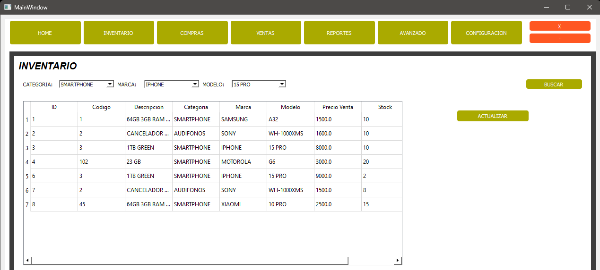

# Sistema de Ventas de Productos

Sistema de ventas creado en Python, diseñado con QtDesigner, con el sistema de gestion de base de datos relacional SQL SERVER.

Implementacion de ComboBox, PushButton, DateEdit, TableWidget, etc, en cada ventana.

Las ventanas estan diseñadas en QtDesigner en la carpeta files_ui con terminaciones .ui y convertidas a python .py en la carpeta views

Las funcionalidades del programa estan en la carpeta controllers.

La conexion a la base de datos esta en db/conexion_sql.py

Ventanas Sesion, Home, Inventario, Compras, Ventas, Reportes, Avanzado, Configuracion

Cuenta con Inicio de Sesion vinculado con la base de datos para acceder.

En la ventana Inventario se pueden hacer busqueda de producto según el modelo a buscar.

En la ventana Compras se puede realizar nueva compra para añadir al Inventario y hacer busquedas ya sea por Fecha, Categoria, Marca y Modelo

En la ventana Venta se realiza el proceso de venta ingresando los datos del cliente, el tipo de pago y los productos en el boton "Buscar", y seguir con el boton "PROCESAR" para completar la venta.

En la ventana Reportes se visualiza las ventas realizadas con todo detalle segun vendedor a cargo, fecha, o producto, generando un reporte.

En la ventana Avanzado se podra realizar reportes con MATPLOTLIB.

En la ventana configuracion podra tener acceso el Administrador para modificar permisos y datos de todos los usuarios que esten registrados en la base de datos.

## Autor

- [@Neampi](https://github.com/Neampi)

## Imagenes

QT DESIGNER LOGIN

QT DESIGNER PRINCIPAL

QT DESIGNER REGISTRO COMPRAS

QT DESIGNER SELECCION DE PRODUCTOS

REGISTRO COMPRAS

INVENTARIO

SELECCION DE PRODUCTOS

CONEXION A BASE DE DATOS

